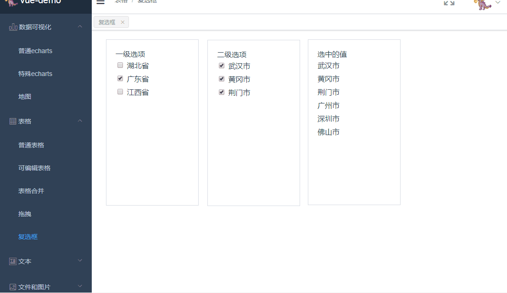

> vue multiple check component


## Install

```
npm install vue-multiple-check 
```

## Attributes

| 参数 | 说明 | 类型 | 是否必传 | Default |
|-|-|-|-|-|
| oneCheckData | 复选框选项值 | Array | 必传 | - |
| oneCheckInit | 复选框初始选中值 | Array | 可选 | - |

```
oneCheckData目前数据结构和对象key按下面example结构传值
```

## Example

```
<template>
  <div class="multi-check">
    <multi-check-com :oneCheckData="oneCheckData" :oneCheckInit="oneCheckInit"></multi-check-com>
  </div>
</template>

<script>
import multiCheckCom from 'vue-multiple-check';
export default {
  name: "multiCheck",

  components:{multiCheckCom},

  data() {
    return {
      oneCheckData:[
        {
          id: 1,
          name: "湖北省",
          content: [
            { id: 1, name: "武汉市" },
            { id: 2, name: "黄冈市" },
            { id: 3, name: "荆门市" }
          ]
        },
        {
          id: 2,
          name: "广东省",
          content: [
            { id: 1, name: "广州市" },
            { id: 2, name: "深圳市" },
            { id: 3, name: "佛山市" }
          ]
        },
        {
          id: 3,
          name: "江西省",
          content: [
            { id: 1, name: "南昌市" },
            { id: 2, name: "赣州市" },
            { id: 3, name: "九江市" }
          ]
        }
      ], //一级复选数组
      oneCheckInit:[
        {
          id: 1,
          name: "湖北省",
          content: [
            { id: 1, name: "武汉市" },
            { id: 2, name: "黄冈市" },
            { id: 3, name: "荆门市" }
          ]
        },
        {
          id: 2,
          name: "广东省",
          content: [{ id: 1, name: "广州市" }, { id: 2, name: "深圳市" },{ id: 3, name: "佛山市" }]
        }
      ],
    };
  },

  methods: {}
};
</script>
```
## project
[项目中使用请戳](https://github.com/lanzhsh/vue-demo/blob/master/src/page/tableClassify/MultiCheck.vue)